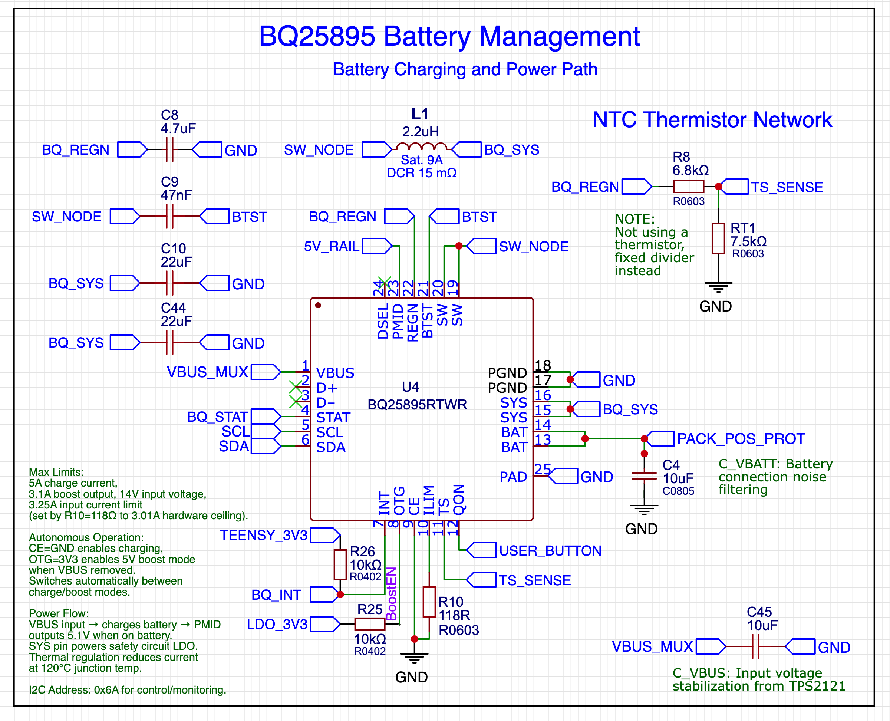

# BQ25895 Driver Library

A C language library for the Texas Instruments BQ25895 Li-Ion battery management IC. This library is designed for integration into projects which require power usage and recharging capability, multiple inputs, and handling one or more lithium-ion batteries. It includes the ability to monitor power status and provide user feedback through the UI about charging, discharging, and power sources.

## Background

This driver interface was developed for the [Pixel Theater](https://github.com/PixelTheater) LED sculptures and related batter-powered project PCBs, and later extracted into a standalone oepn-source library. The BQ25895 chip has some subtle but important implementation details that are not obvious when first designing a circuit. For instance, it supports a thermistor which is optional, but if it's not there, you have to get the voltage levels right. It provides a step-down output using PMID and USB OTG boost mode, but at the same time it can handle higher voltages while providing pass-through capability, which could be damaging to circuits downstream.

We looked for other libraries and found that Adafruit supports a lesser version of this chip, but it's quite different and much simpler. There were a few projects that supported this chip, but the examples and documentation were very lightweight, or the platform usage was not clear. This library attempts to really cover all the bases with this BQ IC.

## Features

- **Core functionality** - mapping of all BQ25895 registers with high-level control methods

- **I2C managed via Adafruit BusIO** - using the industry-standard library for robust communication across platforms

- **Real-time monitoring** - voltage, current, and fault status with automatic updates

- **Safety protection** - configurable voltage thresholds, thermal monitoring, and emergency shutdown

- **Power management** - VBUS detection, power source switching, and ship mode support

- **Error handling** - detailed error reporting with automatic retry mechanisms

- **Voltage safety protection** - automatic shutdown at configurable voltage thresholds for LED protection

- **Fault diagnosis** - detailed fault decoding and reporting with clear status messages

- **Charge optimization** - DPM override, current limit adjustments, and charge restart functionality

- **Emergency modes** - battery-only mode and ship mode for low-power applications

- **Diagnostics** - register dumps, status reports, and voltage analysis for troubleshooting

## Hardware

Supported for Arduino IDE and PlatformIO on modern microcontrollers such as Teensy 4.0/4.1, ESP32, ESP8266, and Raspberry Pi Pico (RP2040). Most of the work on this driver was done in a Teensy environment, but it works on any platform with sufficient memory and I2C support.

### I2C Configuration

- **Default Address**: 0x6A (fixed for BQ25895)
- **Clock Speed**: 100kHz (recommended for reliability)
- **Pull-up Resistors**: 4.7kΩ required on SDA/SCL lines
- **Voltage Levels**: 3.3V or 5V I2C compatible

## Quick Start

### Installation

```bash
# Clone the repository
git clone https://github.com/[org]/BQ25895Driver.git

# For PlatformIO projects
lib_deps = https://github.com/[org]/BQ25895Driver.git

# For Arduino IDE
# Download ZIP and install via Sketch > Include Library > Add .ZIP Library
```

### Basic Usage

```cpp
#include <Wire.h>
#include <Adafruit_I2CDevice.h>
#include "BQ25895Driver.h"

Adafruit_I2CDevice i2c_dev(BQ25895_I2C_ADDR, &Wire1);
BQ25895Driver charger(&i2c_dev);

void setup() {
    Wire1.begin();
    BQ25895Config config = BQ25895ConfigPresets::PortableDevice();
    charger.initialize(config);
    charger.enableCharging();
}
```

See the [examples](examples/) directory for complete working examples.

## Configuration and Status

The library provides status and metrics structures that are used to get information from the BQ25895. The `BQ25895Status` structure contains charging state, fault information, and VBUS detection. The `BQ25895Metrics` structure provides voltage and current measurements. Both can be retrieved using the driver's `getStatus()` and `getMetrics()` methods. See the [examples](examples/) for detailed usage.

## Safety Features

### Voltage Protection

Automatic voltage monitoring to protect connected components (especially LEDs):

```cpp
// Automatic voltage safety checking
if (!charger.checkVoltageSafety()) {
    // System voltage > 5.5V - automatic emergency shutdown
    Serial.println("EMERGENCY: Voltage protection activated");
}

// Check if system is in emergency mode
if (charger.isInEmergencyMode()) {
    Serial.println("System in protective shutdown mode");
}
```

### Thermal Protection

Built-in thermal monitoring with NTC thermistor support:

```cpp
BQ25895Metrics metrics = charger.getMetrics();
if (metrics.tsVoltage < 2400 || metrics.tsVoltage > 3700) {
    Serial.printf("Thermal protection: TS voltage %.2fV\n", metrics.tsVoltage / 1000.0);
}
```

### Fault Detection

Comprehensive fault monitoring and reporting:

```cpp
uint8_t faults = charger.getFaultRegister();
if (faults != 0) {
    String faultDesc = charger.decodeFaults(faults);
    Serial.printf("Faults detected: %s\n", faultDesc.c_str());
    charger.clearFaults();  // Clear after handling
}
```

## Debugging and Diagnostics

### Register Diagnostics

```cpp
// Full register dump for debugging
Serial.print(charger.getRegisterDiagnostics());

// Voltage analysis
Serial.print(charger.getVoltageAnalysis());

// Power status summary
Serial.print(charger.getPowerStatusSummary());
```

### Error Handling

```cpp
if (!charger.setChargeCurrent(1500)) {
    Serial.printf("Failed to set charge current: %s\n", charger.getLastError().c_str());
}
```

## Integration Examples

### Raspberry Pi Pico (RP2040)

```cpp
#include <Wire.h>
#include <Adafruit_I2CDevice.h>
#include "BQ25895Driver.h"

Adafruit_I2CDevice i2c_dev(BQ25895_I2C_ADDR, &Wire);  // Use default Wire
BQ25895Driver charger(&i2c_dev);

void setup() {
    Wire.begin();  // Default I2C pins (GP4=SDA, GP5=SCL)
    // ... rest of setup
}
```

### Teensy 4.x (Recommended)

```cpp
#include <Wire.h>
#include <Adafruit_I2CDevice.h>
#include "BQ25895Driver.h"

Adafruit_I2CDevice i2c_dev(BQ25895_I2C_ADDR, &Wire1);  // Use Wire1 for better pin placement
BQ25895Driver charger(&i2c_dev);
```

### ESP32

```cpp
#include <Wire.h>
#include <Adafruit_I2CDevice.h>
#include "BQ25895Driver.h"

// Custom I2C pins for ESP32
Adafruit_I2CDevice i2c_dev(BQ25895_I2C_ADDR, &Wire);
BQ25895Driver charger(&i2c_dev);

void setup() {
    Wire.begin(21, 22);  // SDA=21, SCL=22 for ESP32
    // ... rest of setup
}
```

## Reference Schematic

Here is the relevant schematic for the BQ25895 driver that was used to develop this library.



## Contributing

1. Fork the repository
2. Create a feature branch
3. Add tests for new functionality
4. Ensure compatibility across supported platforms
5. Submit a pull request

## License

This project is licensed under the MIT License - see the [LICENSE](LICENSE) file for details.

## Version History

- **v1.0.0**: Initial standalone release
  - Complete BQ25895 register control
  - Arduino/Teensy compatibility
  - Voltage safety features
  - Comprehensive diagnostics

## Support

- GitHub Issues: Report bugs and request features
- Organization: [Pixel Theater](https://github.com/PixelTheater)
- code author Jeremy Seitz [website](https://somebox.com)

---

**Note:** This library is intended for hobbyist projects and DIY applications, not for professional battery charging systems. It was co-developed using AI (Gemini/Claude) with a lot of testing and trial and error.
